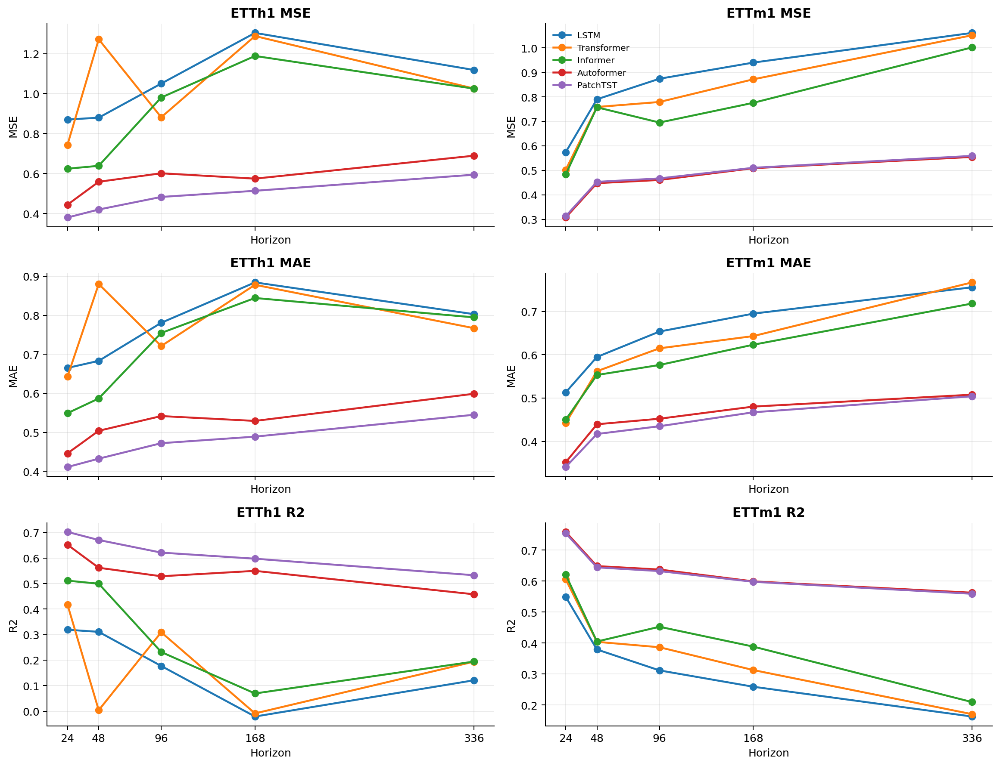
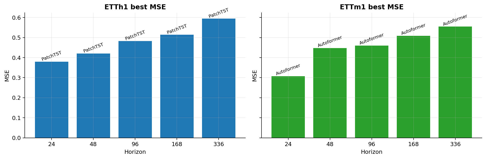
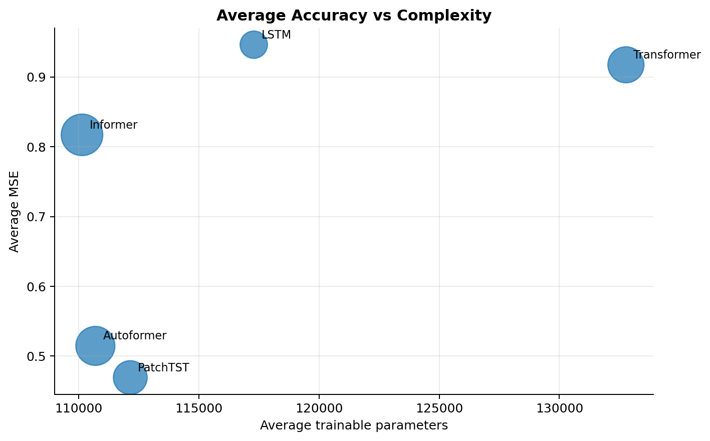
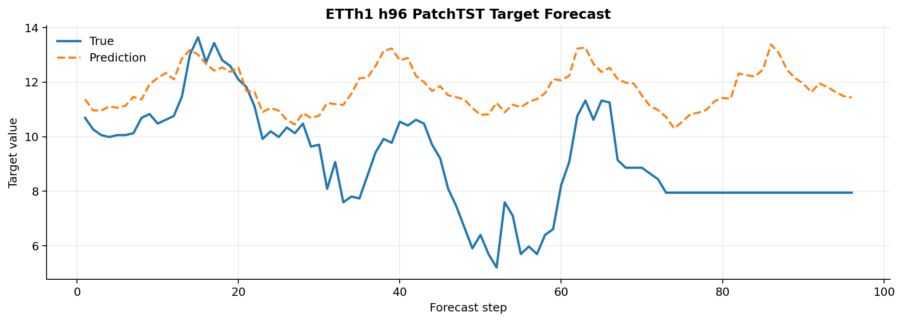
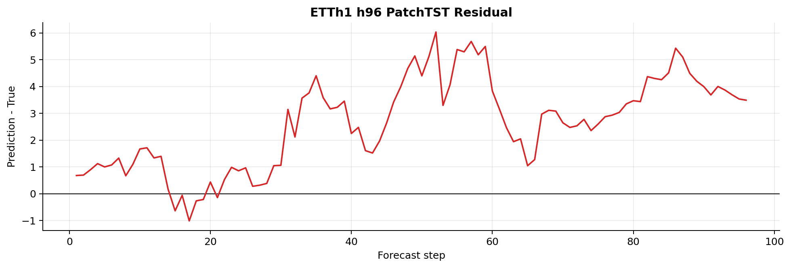
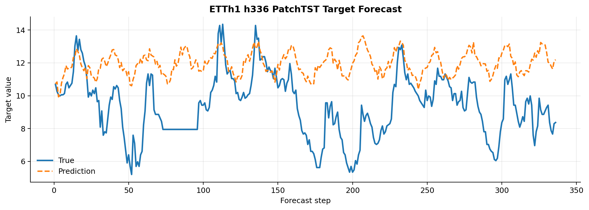
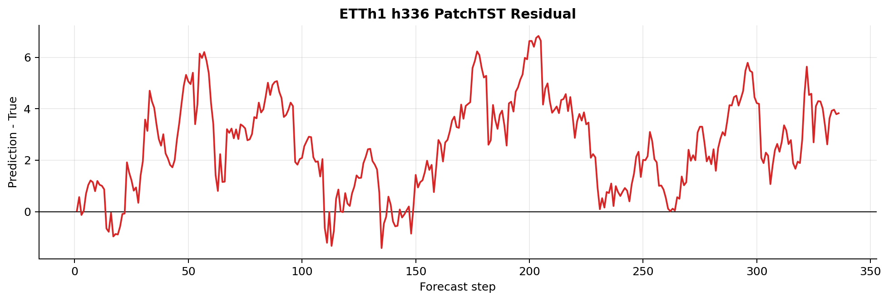
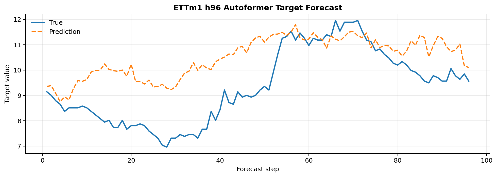
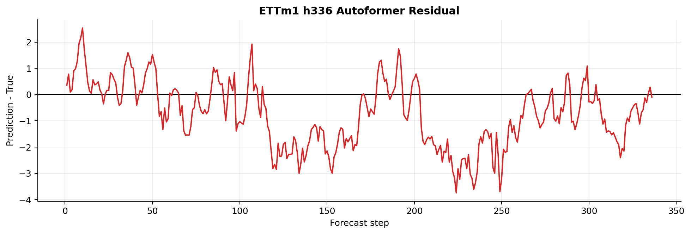
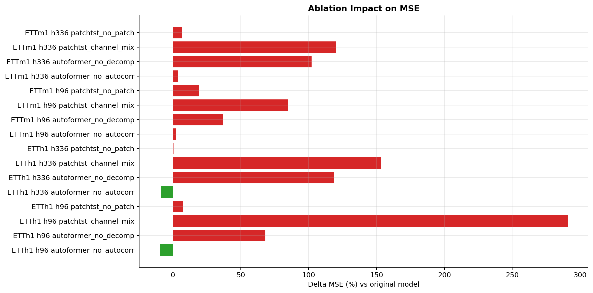

# 基于 LSTM、Transformer、Informer、Autoformer 与 PatchTST 的长时序预测实验报告

## 摘要

本项目围绕长时序预测任务，对比 LSTM、Transformer、Informer、Autoformer 与 PatchTST 五类模型在 ETTh1 与 ETTm1 数据集上的多步预测表现。实验统一采用回看窗口 96，预测步长设置为 24、48、96、168、336，并使用 MSE、MAE、R² 作为主要评价指标。核心实验共完成 `2 数据集 × 5 步长 × 5 模型 = 50` 组正式训练；消融实验围绕 Autoformer 与 PatchTST 的关键结构完成 16 组对比。结果表明，PatchTST 在 ETTh1 上五个预测步长均取得最低 MSE，Autoformer 在 ETTm1 上五个预测步长均取得最低 MSE；消融结果进一步说明 PatchTST 的通道独立建模与 Autoformer 的序列分解模块是性能提升的关键来源。

## 1. 研究背景与任务

长时序预测需要根据历史观测序列推断未来多个时间步的变化趋势，广泛应用于能源负荷、交通流量、气象监测和工业设备状态预测等场景。传统循环神经网络能够处理序列依赖，但在长预测窗口下容易出现梯度衰减、误差累积和并行效率不足等问题。Transformer 通过自注意力机制增强长距离依赖建模能力，但标准注意力的二次复杂度也带来计算和内存开销。

本实验选取 LSTM 与 Transformer 作为基础对照，并加入 Informer、Autoformer、PatchTST 三种面向长时序预测的高效 Transformer 变体，重点回答以下问题：

1. RNN 基线与 Transformer 及其变体在长步长预测中表现如何？
2. 随着预测步长从 24 增加到 336，不同模型的误差如何衰减？
3. Autoformer 的序列分解与 Auto-Correlation、PatchTST 的 patching 与 channel independence 是否真正有效？
4. 模型性能、参数量和训练耗时之间是否存在明显权衡？

## 2. 数据集与实验设置

### 2.1 数据集

本阶段主实验聚焦两个 ETT 数据集，ECL 暂不进入主结果矩阵，后续可作为高维附录实验。

| 数据集 | 变量数 | 频率 | 切分方式 | 说明 |
| --- | ---: | --- | --- | --- |
| ETTh1 | 7 | 小时 | 前 12 月 / 4 月 / 4 月 | 电力变压器温度小时级数据 |
| ETTm1 | 7 | 15 分钟 | 前 12 月 / 4 月 / 4 月 | 电力变压器温度分钟级数据 |

数据预处理采用时间顺序划分，避免训练集、验证集与测试集之间发生未来信息泄露。所有输入变量经过标准化处理，预测曲线图在展示时使用 `scaler.npz` 对目标列反归一化回原始量纲。

### 2.2 统一配置

| 配置项 | 取值 |
| --- | --- |
| 回看窗口 | 96 |
| 预测步长 | 24、48、96、168、336 |
| 模型 | LSTM、Transformer、Informer、Autoformer、PatchTST |
| 正式 run tag | `formal_seed42` |
| 随机种子 | 42 |
| 最大 epoch | 20 |
| early stopping patience | 5 |
| batch size | 32 |
| learning rate | 0.001 |
| weight decay | 0.00001 |
| 评价指标 | MSE、MAE、R²；结果文件中同时保留目标列指标 |

## 3. 模型方法概述

### 3.1 LSTM

LSTM 是循环神经网络的经典变体，通过输入门、遗忘门和输出门缓解普通 RNN 的梯度衰减问题。本实验中 LSTM 作为 RNN 基线，用于衡量传统序列模型在长预测窗口下的性能下限。

### 3.2 Transformer

Transformer 使用自注意力机制建模任意时间步之间的依赖关系，具备良好的并行能力。但标准自注意力复杂度为 `O(L^2)`，当输入序列较长或预测任务较复杂时，容易出现计算成本高和长步长预测退化。

### 3.3 Informer

Informer 通过 ProbSparse Attention 降低长序列注意力计算开销，并使用蒸馏结构减少序列长度。它适合长序列建模，但在本项目当前轻量配置下，整体表现弱于 Autoformer 与 PatchTST。

### 3.4 Autoformer

Autoformer 引入序列分解思想，将时间序列拆分为趋势项和季节项，并通过 Auto-Correlation 机制捕捉周期依赖。实验结果显示，它在 ETTm1 上尤其稳定，说明分解机制对高频序列中的周期与趋势结构有明显帮助。

### 3.5 PatchTST

PatchTST 将时间序列切分为 patch 后输入 Transformer，并采用通道独立建模。它在 ETTh1 上表现最强，消融实验也表明 channel independence 对性能贡献非常突出。

## 4. 核心实验结果

### 4.1 指标趋势

整体趋势显示，PatchTST 与 Autoformer 是当前实验中最稳定的两类模型。随着预测步长增大，所有模型都出现不同程度的 MSE/MAE 上升与 R² 下降，说明长期预测任务存在明显误差累积。

### 4.2 各数据集与步长最优模型

| dataset | horizon | model | MSE | MAE | R2 |
| --- | --- | --- | --- | --- | --- |
| ETTh1 | 24 | patchtst | 0.380213 | 0.411152 | 0.702517 |
| ETTh1 | 48 | patchtst | 0.420251 | 0.432552 | 0.670760 |
| ETTh1 | 96 | patchtst | 0.483175 | 0.472237 | 0.621377 |
| ETTh1 | 168 | patchtst | 0.513911 | 0.489040 | 0.597451 |
| ETTh1 | 336 | patchtst | 0.594367 | 0.545011 | 0.532757 |
| ETTm1 | 24 | autoformer | 0.307059 | 0.351648 | 0.758935 |
| ETTm1 | 48 | autoformer | 0.447473 | 0.439475 | 0.648585 |
| ETTm1 | 96 | autoformer | 0.460524 | 0.452287 | 0.637520 |
| ETTm1 | 168 | autoformer | 0.508573 | 0.480255 | 0.599255 |
| ETTm1 | 336 | autoformer | 0.554604 | 0.507802 | 0.562683 |

ETTh1 上 PatchTST 在五个 horizon 中全部领先，说明 patch 化输入和通道独立建模对小时级 ETT 数据较为有效。ETTm1 上 Autoformer 全部领先，说明更高频率的 15 分钟数据中，趋势/季节分解能更好捕捉局部周期与长期变化。

### 4.3 模型平均表现与复杂度

| model | MSE | MAE | R2 | model_params | train_time_seconds |
| --- | --- | --- | --- | --- | --- |
| patchtst | 0.469335 | 0.451390 | 0.631359 | 112140.800000 | 197.319449 |
| autoformer | 0.514711 | 0.485138 | 0.595797 | 110688.600000 | 263.690795 |
| informer | 0.817005 | 0.644982 | 0.358376 | 110131.800000 | 299.005646 |
| transformer | 0.917335 | 0.691747 | 0.279686 | 132768.000000 | 225.110838 |
| lstm | 0.946142 | 0.702745 | 0.257014 | 117280.000000 | 128.939526 |

从平均结果看，PatchTST 的 MSE 最低，训练耗时也低于 Autoformer 与 Informer，表现出较好的性能与效率平衡。LSTM 训练耗时最短，但误差最高；Transformer 参数量最高，性能却弱于 Autoformer 与 PatchTST，说明标准 Transformer 结构并不能直接适配当前长时序预测任务。

## 5. 预测曲线与残差分析

预测曲线使用已有 `formal_seed42` checkpoint 对测试集首批样本进行推理，不重新训练模型。目标列经过反归一化后绘制。

### 5.1 ETTh1 h96 PatchTST

h96 预测中，PatchTST 能捕捉局部周期变化，但在部分急剧波动处仍存在平滑化倾向。残差图显示误差在局部区间会持续偏正或偏负，说明模型在短期突变位置仍会出现相位或幅值偏差。

### 5.2 ETTh1 h336 PatchTST

h336 预测更能体现长期误差累积：模型更倾向于输出平滑趋势，对远期细节波动的刻画变弱。这与长步长下 MSE 上升、R² 下降的整体趋势一致。

### 5.3 ETTm1 h96 与 h336 Autoformer

Autoformer 在 ETTm1 上整体最优，说明序列分解对高频数据的趋势和周期建模较有效。但在 h336 长步长下，残差仍会随预测窗口拉长而扩大，说明即使强模型也难以完全避免远期预测中的不确定性累积。

## 6. 消融实验

### 6.1 消融设计

围绕 Autoformer 和 PatchTST 设计 4 个消融变体：

| 消融模型 | 对应原模型 | 消融目标 | 消融方式 |
| --- | --- | --- | --- |
| `autoformer_no_decomp` | Autoformer | Series Decomposition | 关闭分解，趋势分支置零 |
| `autoformer_no_autocorr` | Autoformer | Auto-Correlation | 替换为标准多头自注意力 |
| `patchtst_no_patch` | PatchTST | Patching | 使用逐时间点线性投影替代 patch embedding |
| `patchtst_channel_mix` | PatchTST | Channel Independence | 混合多变量输入，取消通道独立建模 |

消融范围为 ETTh1、ETTm1 两个数据集，h96 与 h336 两个代表性预测步长，共 16 组正式消融实验。

### 6.2 平均消融影响

| ablation | delta_MSE_pct | delta_MSE | delta_R2 |
| --- | --- | --- | --- |
| mix_channels | 162.247008 | 0.845824 | -0.664538 |
| remove_decomposition | 81.484008 | 0.491294 | -0.386341 |
| remove_patching | 8.543253 | 0.041929 | -0.032984 |
| replace_autocorr_with_attention | -3.153671 | -0.022206 | 0.017405 |

结果显示，PatchTST 的通道独立性贡献最大，移除后平均 MSE 上升 162.25%。Autoformer 的序列分解模块同样关键，移除后平均 MSE 上升 81.48%。PatchTST 的 patching 机制整体有效，但影响幅度小于通道独立性。Auto-Correlation 的结果更复杂：在 ETTh1 上替换为标准注意力反而略优，在 ETTm1 上则原 Auto-Correlation 略优，说明当前轻量 Autoformer 配置仍有优化空间。

## 7. 误差累积与季节波动性讨论

从 h24 到 h336，PatchTST 和 Autoformer 虽然保持领先，但 MSE 仍随预测步长增加而上升。这说明长时序预测中的误差不是单个模型可以完全消除的问题，而是由远期不确定性、局部突变难以提前判断、周期相位偏移等因素共同导致。

ETT 数据具有明显周期性和趋势性。Autoformer 通过序列分解显式建模趋势和季节项，因此在 ETTm1 这种高频数据上表现稳定；PatchTST 则通过 patch 化降低输入长度并保持局部片段结构，在 ETTh1 小时级数据上能更好保留局部模式。预测曲线也显示，模型对平滑周期变化的拟合更好，而对突变和远期细节波动的拟合较弱。

## 8. 超参数与实验经验

1. 统一回看窗口 96 能保证不同模型输入一致，便于公平比较。
2. `epochs=20` 与 `patience=5` 在当前规模下可以较快完成正式实验，同时避免明显过拟合。
3. 使用 `run_tag` 区分 `formal_seed42`、`ablation_seed42`、smoke 等实验非常重要，可避免结果覆盖和汇总混入临时实验。
4. Windows 环境下应优先确认 CUDA 环境，避免误用 CPU Python 解释器造成训练耗时异常。
5. 对 ECL 这类高维数据，应先做 smoke 或附录实验，再决定是否进入完整主矩阵。

## 9. 结论与展望

本项目完成了长时序预测的完整实验链路：数据预处理、五类模型实现、核心实验、消融实验、可视化分析和报告整理。实验结果支持以下结论：

1. PatchTST 是 ETTh1 上最强模型，五个预测步长均取得最低 MSE。
2. Autoformer 是 ETTm1 上最强模型，五个预测步长均取得最低 MSE。
3. 与 LSTM、标准 Transformer、Informer 相比，PatchTST 与 Autoformer 在长步长预测中更稳定。
4. 消融实验验证了结构贡献：PatchTST 的 channel independence 与 Autoformer 的 series decomposition 是最关键模块。
5. 长步长预测仍存在明显误差累积，预测曲线和残差图显示模型对突变与远期细节仍不够敏感。

后续工作可从三个方向继续推进：第一，补充 ECL 高维数据实验，验证模型在大变量规模下的泛化能力；第二，对 Autoformer 和 PatchTST 做更系统的超参数搜索，例如 patch length、模型宽度、分解窗口等；第三，引入多随机种子重复实验，报告均值和方差，提高结论稳健性。

## 附：主要结果文件

- `results/v1_csv/formal/formal_seed42_all.csv`
- `results/v1_md/formal/formal_seed42_all.md`
- `results/v1_csv/ablation/ablation_seed42_summary.csv`
- `results/v1_md/ablation/ablation_seed42_summary.md`
- `results/v1_csv/ablation/ablation_seed42_vs_formal_comparison.csv`
- `results/v1_md/ablation/ablation_seed42_vs_formal_comparison.md`
- `results/figures/manifest.json`
- `results/v1_csv/figures/prediction_samples_summary.csv`
